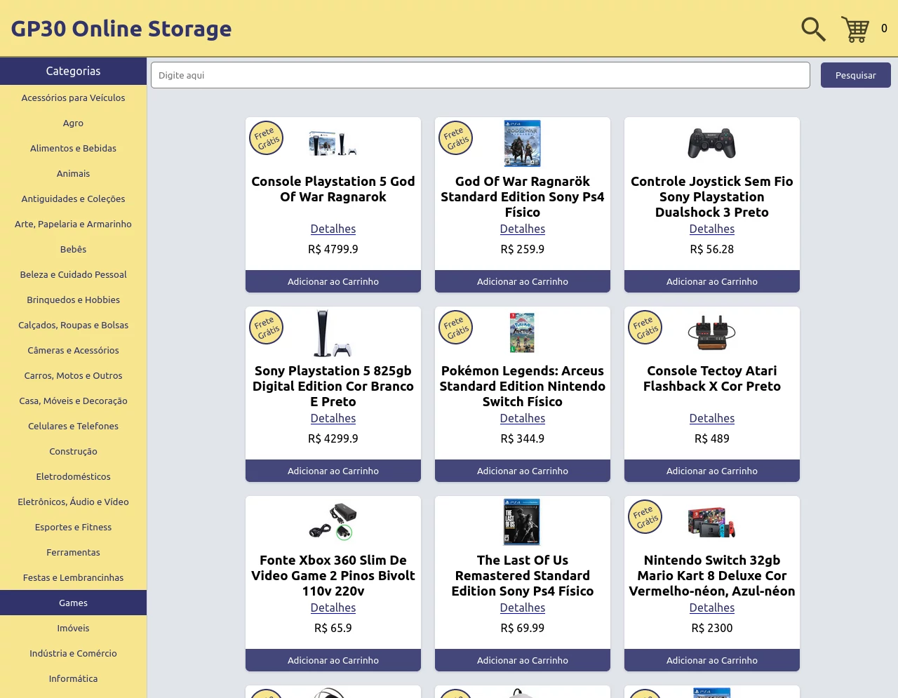
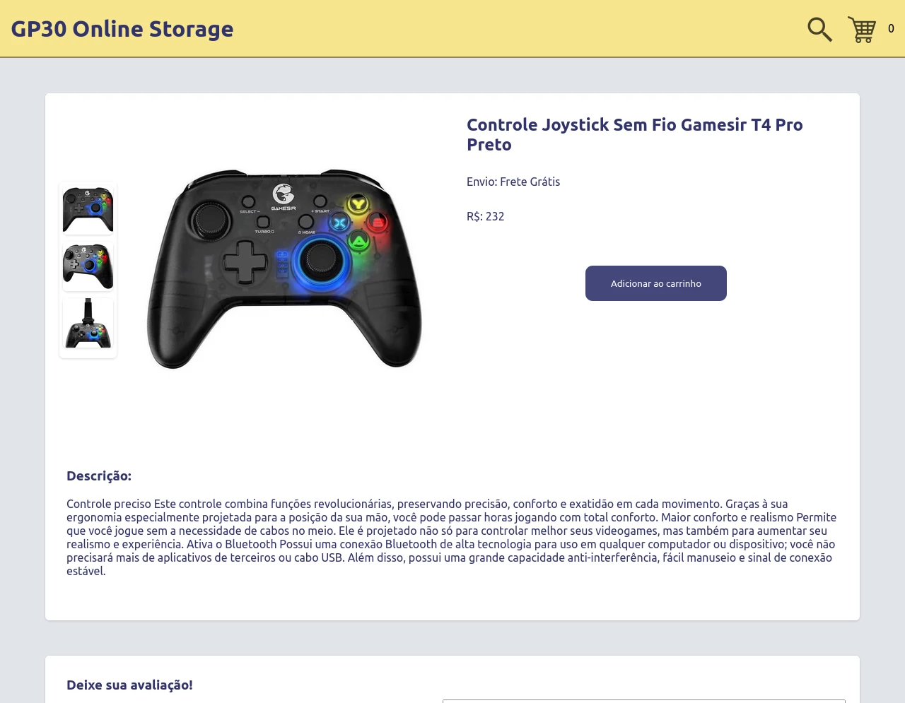
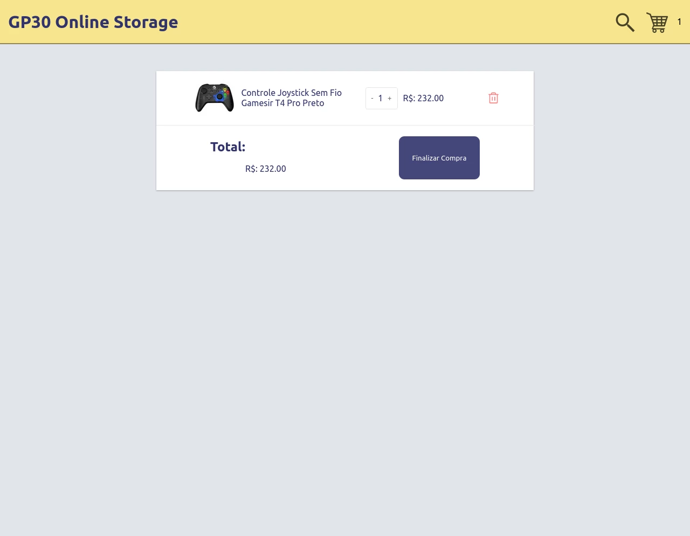

# Sobre

## Seção: `Metodologias Ágeis`

- Nessa seção fui introduzido o manifesto ágil e funcionamento de metodologias Ágeis, usando o método kanban e o framework Scrum.
- Apresentando como aplicações eram desenvolvidos antigamente(cascata), que somente no final da produção, era apresentando algo para o cliente, gerando um grande retrabalho devido a essa falta de comunicação. E isso fez necessária a criação de princípios para melhor eficiência e produtividade(existem vários outros fora o kanban e o scrum).
- A importância dos princípios apresentados nessa seção foram de facilitar e agilizar os processo e entregas da equipe, sem gerar complexidade desnecessários.
- Para tornar isso possível, o desenvolvimento foi segmentando em pequenos ciclos(sprints) que variam de tempo de 2 semanas há 4 semanas.
#

  

>*clique na imagem para acesso online do projeto*
#
## Projeto: `Frontend Store`
- Desensolvemos uma aplicação simulando um e-commerce, usando API do Mercado Livre, onde é possível filtrar o conteúdo de busca, por categoria ou por nome, visualizar detalhes do produto, adicionar comentários avaliativos, adicionar ao carrinho e acessar o carrinho, acessando ele é possível alterar a quantidade dos itens no carrinho conforme sua disponibilidade fornecido pela API.

# Tecnologias e ferramentas usadas 🛠

# Desafios

- Focamos no trabalho em equipe e aplicar as lições apresentadas na seção usando o ágil, usamos o kanban para deixar nítida as atividades que fazíamos de forma separada, inicialmente avaliamos os primeiros requisitos necessários e focamos em aprender junto o material que iriamos usar, alimentando nossa aplicação com a API, e usando o localstorage para manter dados que precisávamos salvar.
- Analisamos cada membro do grupo, dividimos em grupos menores visando mais produtividade no desenvolvimento, vimos quem sentia mais confortável desenvolvendo, para ajudar na evolução da pessoa com mais dificuldade.
- Tecnicamente o maior problema que encontramos nesse projeto era de fornecer alguma informação entre os componentes, eramos limitados ao props drilling, passando o estado de um componente pai para um filho em forma de cascata, sendo algo bem confuso e com uma aparência bagunçada.

# Conclusão

- Apesar de não ser a primeira atividade em grupo, foi a primeira com bem mais que 1 integrante, o pessoal tinha a cabeça aberta para ideias, colaboratividade e transparentes com suas dificuldades. Foi um desenvolvimento leve, descontraído e amistoso.

  

    <strong>
      :newspaper_roll: Requisitos solicitados durante o desenvolvimento do projeto
    </strong>
  

 
### Requisitos
*Nome* | *Avaliação*
--- | :---:
1 - Implemente o módulo de acesso à api do Mercado Livre | :heavy_check_mark:
2 - Crie uma página de listagem de produtos vazia | :heavy_check_mark:
3 - Crie a página do carrinho de compras| :heavy_check_mark:
4 - Liste as categorias de produtos disponíveis via API na página principal | :heavy_check_mark:
5 - Liste os produtos buscados por termos, com os dados resumidos, associados a esses termos | :heavy_check_mark:
6 - Selecione uma categoria e mostre somente os produtos daquela categoria | :heavy_check_mark:
7 - Redirecione para uma tela com a exibição detalhada ao clicar na exibição resumida de um produto| :heavy_check_mark:
8 - Adicione produtos a partir da tela de listagem de produtos | :heavy_check_mark:
9 - Adicione um produto ao carrinho a partir de sua tela de exibição detalhada | :heavy_check_mark:
10 - Visualize a lista de produtos adicionados ao carrinho em sua página e permita a manipulação da sua quantidade | :heavy_check_mark:
11 - Avalie e comente acerca de um produto em sua tela de exibição detalhada | :heavy_check_mark:
12 - Finalize a compra vendo um resumo dela, preenchendo os seus dados e escolhendo a forma de pagamento | :heavy_check_mark:
13 - Mostre junto ao ícone do carrinho a quantidade de produtos dentro dele, em todas as telas em que ele aparece | :heavy_check_mark:
14 - Limite a quantidade de produtos adicionados ao carrinho pela quantidade disponível em estoque | :heavy_check_mark:
15 - Mostre quais produtos tem o frete grátis | :heavy_check_mark:

  

    <strong>
      :memo: Todo list
    </strong>
  

  - [x] - ~~Criar aplicação com base nos requisitos da trybe.~~ 
  - [x] - ~~Revisar Estilo dos elementos da página.~~ 
  - [ ] - Desenvolver testes automatizados.
  - [ ] - Adaptar elementos da aplicação para mobile.

#
## Membros:

  <a href="https://www.linkedin.com/in/brunolorenzonlouzada/">
    
  <a href="https://www.linkedin.com/in/davidrogger">
    
  <a href="https://www.linkedin.com/in/nelipefunes">
    
  <a href="https://www.linkedin.com/in/jcoelhoo/">
    
  <a href="https://www.linkedin.com/in/rafaelqfg/">
    

#

  

